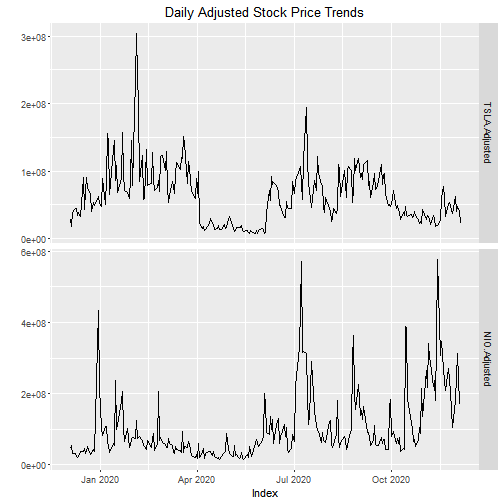

Stock Price Analysis App
========================================================
author: Mark Kiel
date: "2020-12-04"

Purpose and Requirements
========================================================

Create a relatively simple application that tries to
fulfill these requirements:

- Allows a user to look up a symbol on two of the largest
  American stock exchanges and get the security name.
- Plot a time series of the adjusted closing stock price
  for up to four different stock symbols.
- Choose a specific start date to compare price trends
  over the same time period.
- Lets a user enable and disable a specific plot just
  by checking a box.

Demo: Choosing a Stock Symbol
========================================================

 
Symbol lookup

    <select id="symbols" onchange="updateCompany()">AAPL</select>
    <input type="radio" name="exchange">Nasdaq</input>
    <input type="radio" name="exchange">NYSE</input>
     
    ATA Creativity Global - American Depositary Shares, each representing two common shares
  

Using the drop-down box, choose a ticker symbol and see the company name and
description below the choice. In the application, choosing the exchange type
will populate the drop-down with different choices.

Demo: Viewing a Time Series Plot
========================================================

    
The application allows for up to four different
        stock symbol time series to be displayed for comparison. The start date
        is also adjustable.
    

Closing Thoughts
=======================================================
Finished application is at Shinyapps.io:
[tracermak.shinyapps.io/coursera-project](https://tracermak.shinyapps.io/coursera-project)
 
Application and presentation source on GitHub:
[github.com/TracerMAK/coursera-shiny-app](https://github.com/TracerMAK/coursera-shiny-app)
  
Goals during application development: 
(1) Explore the various Shiny Widgets 
(2) Incorporate custom html and css within the markdown 
(3) Learn the reactive programming environment 
(4) Develop something that could be extended further with more features
